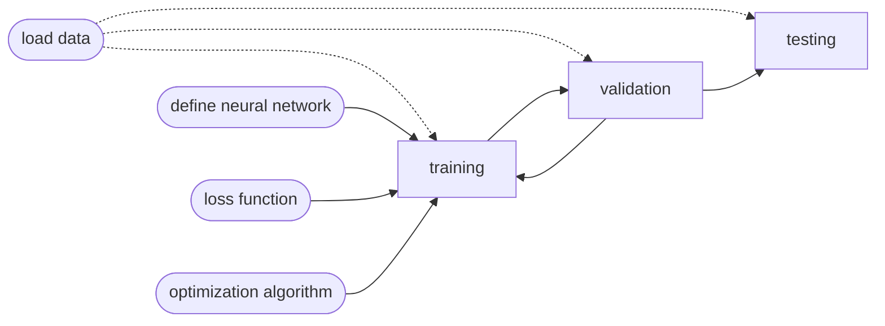

[ML 2022 Spring (ntu.edu.tw)](https://speech.ee.ntu.edu.tw/~hylee/ml/2022-spring.php) 

HUNG-YI LEE 李宏毅@NTU


## week 1

### lec 2021 1

Training


1 epoch = see all the batches once (during optimization period)

1. compute gradient $g = \gradient L^1(\theta^0)$
2. updata $\theta^1\leftarrow\theta^0-\eta g$
3. compute gradient $g = \gradient L^2(\theta^1)$
4. updata $\theta^2\leftarrow\theta^1-\eta g$
5. compute gradient $g = \gradient L^3(\theta^2)$
6. updata $\theta^3\leftarrow\theta^2-\eta g$


### lec 1

ML = looking for a function

Function types

|            input            |     output     |
| :-------------------------: | :------------: |
|           vector            |     scalar     |
|     Matrix(e.g. image)      | classification |
| sequence(e.g. speech, text) |  Text, image   |

- supervised learning👆
- Self-supervised learning👇

Pre-train: 基本功 -> downstream tasks下游任务

e.g. BERT, GPT

Reinforcement Learning (RL)

不知道怎么标注，但是可以定义好坏的时候可以用RL，e.g.围棋中的成果

Anomaly Detection

Explainable AI

Model Attack

Domain Adaptation

Network Compression

Life-long Learning

Meta learning


### tut 1

Pytorch



```python
import torch.nn as nn

class MyModel(nn.Module):
  def __init__(self):
    # Initialize your model & define layers
    super(MyModel, self).__init__() 
    self.net = nn.Sequential( 
      nn.Linear(10, 32), 
      nn.Sigmoid(), 
      nn.Linear(32, 1) 
    )

  def forward(self, x):
    # Compute output of your NN
    return self.net(x)
```

👇Slides 39 - 42

#### Training Setup

```python
dataset = MyDataset(file) 
tr_set = DataLoader(dataset, 16, shuffle=True) 
model = MyModel().to(device) 
criterion = nn.MSELoss() 
optimizer = torch.optim.SGD(model.parameters(), 0.1)
```

#### Training Loop

```python
for epoch in range(n_epochs):
	model.train() 
  for x, y in tr_set:
    optimizer.zero_grad() 
    x, y = x.to(device), y.to(device) 
    pred = model(x) 
    loss = criterion(pred, y) 
    loss.backward() 
    optimizer.step()
```

#### Validation Loop

```python
model.eval()  # set model to evaluation mode
total_loss = 0 
for x, y in dv_set:
  x, y = x.to(device), y.to(device) 
  with torch.no_grad():
    pred = model(x)
    loss = criterion(pred, y) 
  total_loss += loss.cpu().item() * len(x) 
  avg_loss = total_loss / len(dv_set.dataset)
```

#### Testing Loop

```python
model.eval()  # set model to evaluation mode
preds = [] 
for x in tt_set:
  x = x.to(device) 
  	with torch.no_grad():
      pred = model(x)
      preds.append(pred.cpu())
```

### tut 2

Hw1 notes

### tut 3

colab

- Using an exclamation mark (!) starts a new shell, does the operations, and then kills that shell
- percentage (%) affects the process associated with the notebook, and it is called a magic command.
- Use % instead of ! for cd (change directory) command

use `nvidia-smi` to check the allocated GPU type


Colab disconnect if idle timeout(90 min., sometimes varying) or when your screen goes black

solution: keep your screen on or try using javascript

